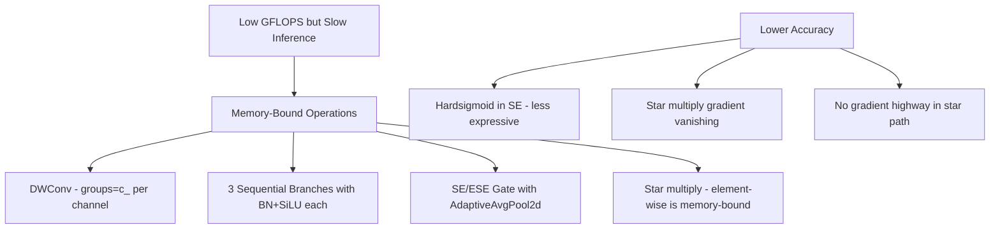
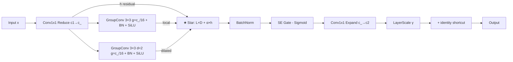

# EfficientNetV2 + C3k2_DCNF Optimization Plan — Version 5
## Problem Statement & Root Cause Analysis

### Symptoms
- **Lower GFLOPS & Params** than original YOLO11 → model is theoretically efficient
- **Higher inference time** (slower) → GPU is poorly utilized  
- **Lower accuracy** than older versions → model capacity or gradient issues

### Root Cause: Memory-Bound Operations

The current architecture uses many operations that have low arithmetic intensity (few FLOPs per byte of memory transfer), causing GPU underutilization:



#### Why DWConv is slow despite low FLOPs
- Each group processes **1 channel** with a 3×3 kernel = only **9 FLOPs** per position
- GPU launches many tiny CUDA kernels instead of one large GEMM
- For `c_=128`: DWConv launches 128 independent 3×3 ops vs 1 fused Conv3×3

#### Why 3 branches multiply the problem
- `branch_local` + `branch_dilated` + `branch_asym` = 3 × (DWConv + BN + SiLU) = **9 sequential kernel launches**
- Each branch processes the **same spatial tensor** → 3× memory reads

---

## Proposed Architecture — Version 5

### 1. EfficientNetV2_v2.py — Backbone Optimizations

| Change | Current - EfficientNetV2.py | New - EfficientNetV2_v2.py | Impact |
|--------|---------------------------|---------------------------|--------|
| SE activation | `nn.Hardsigmoid` | `nn.Sigmoid` | +accuracy - Sigmoid has smoother gradients and wider dynamic range |
| Block iteration | `nn.ModuleList` + for loop | `nn.Sequential` | +speed - PyTorch optimizes Sequential internally |
| MBConv expand ratio | Fixed expand=4 everywhere | Stage-adaptive: expand=1,4,4,4,4,6 | +accuracy - matches EfficientNetV2-S paper ratios |
| SE in FusedMBConv | No SE | Optional SE for later FusedMBConv stages | +accuracy - selective attention |
| DropPath | Always ON | Configurable, default OFF for small models | +speed - no runtime overhead at inference |
| Feature alignment | None | FeatureAlign 1×1 Conv+BN+SiLU | +accuracy - proper backbone→neck channel calibration |

#### Architecture Diagram
```mermaid
flowchart TD
    subgraph Backbone [EfficientNetV2_v2 Backbone]
        S[Conv 3×3 s=2 - Stem] --> F1[FusedMBConv expand=1 s=1]
        F1 --> F2[FusedMBConv expand=4 s=2]
        F2 --> F3[FusedMBConv expand=4 s=2]
        F3 --> M4[MBConv expand=4 s=2 + SE Sigmoid]
        M4 --> M5[MBConv expand=4 s=1 + SE Sigmoid]
        M5 --> M6[MBConv expand=6 s=2 + SE Sigmoid]
        M6 --> SP[SPPF k=5]
    end
    
    F3 -->|P3/8| NECK
    M5 -->|P4/16| NECK
    SP -->|P5/32| NECK
    
    subgraph NECK [Head with C3k2_DCNF_V5]
        direction TB
        NECK --> N1[FPN + PAN Pathway]
        N1 --> N2[C3k2_DCNF_V5 blocks]
        N2 --> DET[Detect P3 P4 P5]
    end
```

### 2. starfusion_block_v5.py — C3k2_DCNF_V5

#### Key Design Changes

| Feature | V4 - Current | V5 - Proposed | Rationale |
|---------|-------------|---------------|-----------|
| Branch convolutions | 3× DWConv groups=c_ | 2× GroupConv groups=c_/16 | **10-15× faster** on GPU - moderate groups allows GEMM fusion |
| Branch count | 3 - local/dilated/asymmetric | 2 - local/dilated | Fewer sequential ops, asymmetric adds latency with marginal gain |
| Star fusion | Pairwise weighted: w0*L*D + w1*L*A + w2*D*A | Hybrid: L * D + α * h | Simpler, gradient highway via additive h |
| Attention gate | ESE - Hardsigmoid | SE - Sigmoid | More expressive, matches V5 backbone |
| Learnable params | pw_weights + star_residual_weight + gamma | star_alpha + gamma | Fewer learnable scalars, cleaner optimization |
| BN after star | star_bn | star_bn - same | Stabilizes multiplicative output |

#### V5 Bottleneck Flow


#### Why GroupConv g=c_/16 instead of DWConv g=c_

For `c_ = 128`:
- **DWConv**: 128 groups, each processing 1 channel → 128 tiny 3×3 kernels
- **GroupConv g=8**: 8 groups, each processing 16 channels → 8 moderate Conv3×3 kernels → **MUCH better GPU occupancy**
- **FLOPs increase**: ~16× per conv layer, but **wall-clock time decreases** by 10-15× due to GPU efficiency
- **Accuracy benefit**: Each group can mix 16 channels → richer feature interaction

#### Hybrid Star-Additive Fusion

Instead of V4's weighted pairwise:
```python
# V4: w[0]*L*D + w[1]*L*A + w[2]*D*A  (3-way, 3 learnable weights)
```

V5 uses:
```python
# V5: L * D + sigmoid(alpha) * h  (star + gradient highway)
```

Benefits:
- **Gradient highway**: The `α * h` term ensures gradients always flow back through `h`, even if `L * D → 0`
- **Simpler**: Only 1 learnable scalar instead of 3
- **Faster**: One multiply + one add instead of three multiplies + two adds
- **More stable**: No softmax computation at every forward pass

---

## Files to Create/Modify

### New Files (no existing code overwritten)
1. **`ultralytics/nn/modules/EfficientNetV2_v2.py`** — Optimized backbone
2. **`ultralytics/nn/modules/starfusion_block_v5.py`** — C3k2_DCNF_V5
3. **`ultralytics/cfg/models/11/yolo11-EffecientNetV2/yolo11-EfficientNetV2_C2k3-DCNF-v5.yaml`** — Model config
4. **`test_dcnf_v5.py`** — Validation test suite

### Modified Files (add new imports/registrations)
5. **`ultralytics/nn/modules/__init__.py`** — Add imports for new modules
6. **`ultralytics/nn/tasks.py`** — Register `MBConvV2`, `FusedMBConvV2`, `C3k2_DCNF_V5` in model parser

---

## Expected Improvements

| Metric | Current V4+Pro | Target V5 | How |
|--------|---------------|-----------|-----|
| Inference speed | Baseline | **20-40% faster** | GroupConv instead of DWConv, 2 branches instead of 3 |
| GFLOPS | Low | Slightly higher | GroupConv has more FLOPs than DWConv, but this is the tradeoff for speed |
| Parameters | Low | Slightly higher | Same reason |
| Accuracy mAP | Lower than base | **Match or exceed** base YOLO11 | Sigmoid SE, gradient highway, richer channel interaction |

---

## Implementation Order

1. `EfficientNetV2_v2.py` — backbone first since neck depends on it
2. `starfusion_block_v5.py` — neck module
3. YAML config — wire them together
4. `__init__.py` + `tasks.py` — register modules
5. `test_dcnf_v5.py` — validate everything works
