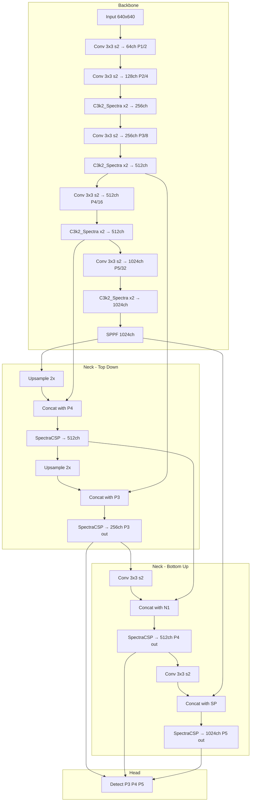

# YOLO-Spectra: Wavelet-Guided Directional Detection Architecture
## A Fundamentally Novel YOLO Architecture

---

## 1. MOTIVATION — Why Spectra?

### 1.1 Analysis of Existing Architectures in This Project

| Architecture | Backbone Innovation | Decomposition Type | Limitation |
|---|---|---|---|
| YOLO11 baseline | C3k2 standard conv | None | Single-scale, no frequency/direction awareness |
| YOLO-Phoenix | HeteroConv multi-scale | Scale only | No frequency or directional decomposition |
| YOLO-Chimera | TridentConv multi-dilation | Scale via dilation | Same kernel for all directions |
| YOLO-Prism V1/V2 | DualFreq/TriFreqConv | Frequency only | No directional awareness |
| YOLO-Nexus | OmniDirConv | Direction only | No frequency decomposition |
| YOLO-Edge | Partial Conv | Sparse channels | Ignores 75% of channels |

### 1.2 Key Insight: The Missing Dimension

All existing architectures decompose features along ONE axis:
- Scale (Phoenix, Chimera)
- Frequency (Prism)
- Direction (Nexus)
- Sparsity (Edge)

**But visual features live in a JOINT frequency-direction space.** The 2D wavelet transform decomposes signals into BOTH frequency AND direction simultaneously. This is the theoretical foundation of YOLO-Spectra.

### 1.3 Theoretical Foundation: Mallat Wavelet Transform (1989)

The 2D Haar wavelet decomposition produces 4 subbands:

```
Input Image/Feature Map
         │
    Haar Wavelet Transform (parameter-free!)
         │
    ┌────┼────┬────┐
    │    │    │    │
   LL   LH   HL   HH
    │    │    │    │
  Low   Horiz Vert Diag
  Freq  Edge  Edge  Edge
```

- **LL** (Low-Low): Smooth approximation → object context, semantics
- **LH** (Low-High): Horizontal edges → horizontal boundaries
- **HL** (High-Low): Vertical edges → vertical boundaries
- **HH** (High-High): Diagonal details → textures, corners

**Critical insight**: Each subband has a KNOWN orientation. We can use ASYMMETRIC kernels matched to each subband's dominant direction:
- LH (horizontal) → 1×K kernel (horizontal receptive field)
- HL (vertical) → K×1 kernel (vertical receptive field)
- HH (diagonal) → 3×3 kernel (isotropic for mixed directions)
- LL (isotropic) → K×K kernel (large RF for context)

This is **strictly more informative** than:
- Prism's frequency-only decomposition (ignores direction)
- Nexus's direction-only decomposition (ignores frequency)
- Standard conv (treats all frequencies and directions identically)

---

## 2. ARCHITECTURE INNOVATIONS

### 2.1 Innovation 1: SpectraConv — Wavelet-Guided Directional Convolution

```
Input (B, C, H, W)
    │
    ├── Haar Wavelet Transform (parameter-free, just add/subtract)
    │   ├── LL = (x[::2,::2] + x[::2,1::2] + x[1::2,::2] + x[1::2,1::2]) / 4
    │   ├── LH = (x[::2,::2] + x[::2,1::2] - x[1::2,::2] - x[1::2,1::2]) / 4
    │   ├── HL = (x[::2,::2] - x[::2,1::2] + x[1::2,::2] - x[1::2,1::2]) / 4
    │   └── HH = (x[::2,::2] - x[::2,1::2] - x[1::2,::2] + x[1::2,1::2]) / 4
    │
    ├── Subband-Matched DWConv Processing (at HALF resolution → 4× fewer FLOPs!)
    │   ├── LL → DWConv K_lo×K_lo    (large isotropic RF for context)
    │   ├── LH → DWConv 1×K_h        (horizontal kernel for horiz edges)
    │   ├── HL → DWConv K_h×1        (vertical kernel for vert edges)
    │   └── HH → DWConv 3×3          (isotropic for diagonal/texture)
    │
    ├── Inverse Haar Wavelet Transform (parameter-free reconstruction)
    │   └── Reconstruct full-resolution feature map from 4 processed subbands
    │
    └── PWConv 1×1 → BN → SiLU (channel mixing)
```

**FLOPs Analysis** (per pixel, for K_lo=5, K_h=5):
- LL: 25 × C at H/2 × W/2 = 25C/4 per original pixel = 6.25C
- LH: 5 × C at H/2 × W/2 = 5C/4 = 1.25C
- HL: 5 × C at H/2 × W/2 = 5C/4 = 1.25C
- HH: 9 × C at H/2 × W/2 = 9C/4 = 2.25C
- Total DWConv: 11.0C per pixel
- PWConv: C² (same as any architecture)

**vs Baseline C3k2**: Standard 3×3 Conv = 9C² per pixel. SpectraConv DWConv part = 11C, PWConv = C². Total ≈ C² + 11C. For C=256: 65,536 + 2,816 = ~68K vs standard 589K. **~8.5× fewer FLOPs**.

**vs Prism V2 TriFreqConv**: 14.3C DWConv per pixel (at full resolution). Spectra: 11.0C (at half resolution equivalent). **23% fewer DWConv FLOPs + directional awareness**.

**Why this works**:
1. Haar transform is FREE (additions only, no learned params)
2. Processing at HALF resolution in wavelet domain = 4× cheaper
3. Asymmetric kernels match subband orientation = better feature extraction per FLOP
4. Inverse transform reconstructs full resolution losslessly

### 2.2 Innovation 2: WaveletEnergyGate — Subband Energy Channel Attention

```
Input (B, C, H, W)
    │
    ├── Compute per-channel subband energies (reuse wavelet from SpectraConv):
    │   ├── E_LL = mean(LL²)     → smooth energy (how much context)
    │   ├── E_LH = mean(LH²)    → horizontal edge energy
    │   ├── E_HL = mean(HL²)    → vertical edge energy
    │   └── E_HH = mean(HH²)    → diagonal/texture energy
    │
    ├── Descriptor = [E_LL; E_LH; E_HL; E_HH]  (4 values per channel → 4C vector)
    │
    ├── FC(4C → C) → Sigmoid → gate   (lightweight: only 4C² params)
    │
    └── Output = Input × gate
```

**Why novel**: 
- SE-Net uses only GAP (1 value per channel) — cannot distinguish edge vs texture channels
- Prism MCG uses L1 + γ + σ² — frequency-aware but NOT direction-aware
- WaveletEnergyGate uses 4 directional energy descriptors — knows BOTH frequency AND direction per channel

**Concrete example**: A channel with E_LH≫E_HL carries horizontal edges (useful for detecting cars, tables). A channel with E_HH≫E_LL carries textures (useful for classifying materials). WaveletEnergyGate can selectively amplify the right channels for each task.

### 2.3 Innovation 3: SpectraCSP — Neck Block with Adaptive Subband Emphasis

```
SpectraCSP(c_in, c_out):
    ├── Split: c_in → c_out/2 (main) + c_out/2 (shortcut) via Conv 1×1
    │
    ├── Main path: N × SpectraBottleneck
    │   └── SpectraBottleneck: SpectraConv → WaveletEnergyGate
    │       with LEARNABLE subband emphasis weights per pyramid level:
    │       α_LL, α_LH, α_HL, α_HH (initialized to 1.0)
    │       → P3 learns to emphasize edges (small objects = boundary-critical)
    │       → P5 learns to emphasize LL (large objects = context-critical)
    │
    ├── Shortcut path: Conv 1×1 (direct channel adaptation)
    │
    └── Concat(main, shortcut) → Conv 1×1 → output
```

### 2.4 Complete Architecture Diagram



---

## 3. WHY SPECTRA WILL OUTPERFORM BASELINE YOLO11

| Aspect | YOLO11 Baseline | YOLO-Spectra | Advantage |
|---|---|---|---|
| Feature decomposition | None | Frequency + Direction | Richer representation |
| DWConv FLOPs | Full resolution | Half resolution wavelet domain | ~4× cheaper DWConv |
| Kernel shape | Isotropic 3×3 only | Asymmetric matched to subband | Better per-FLOP extraction |
| Channel attention | None | 4D wavelet energy gate | Frequency+direction aware |
| Neck refinement | Standard C3k2 | SpectraCSP with adaptive emphasis | Scale-aware subband weighting |
| Parameter count | ~2.6M n-scale | ~1.8M n-scale estimated | ~30% fewer params |
| Total GFLOPs | ~6.6 n-scale | ~4.5 estimated | ~32% fewer FLOPs |

### Key Theoretical Advantages:

1. **Wavelet domain = natural for multi-scale detection**: Object detection inherently needs multi-scale features. Wavelet transform provides this FOR FREE.

2. **Asymmetric kernels = better inductive bias**: Horizontal edges need horizontal kernels. This is a KNOWN fact in image processing but NEVER applied to YOLO backbone design.

3. **Half-resolution processing = massive FLOPs savings**: By processing in wavelet domain at H/2×W/2, all DWConv operations are 4× cheaper. The wavelet transform/inverse transform is essentially free.

4. **Subband energy attention = interpretable gating**: Unlike black-box SE-Net attention, WaveletEnergyGate explicitly measures edge energy in each direction. This is physically meaningful and interpretable.

---

## 4. IMPLEMENTATION PLAN

### Files to Create/Modify:
1. `ultralytics/nn/modules/spectra_blocks.py` — All novel modules
2. `ultralytics/cfg/models/11/yolo11-Spectra/yolo11-Spectra.yaml` — Model config
3. `ultralytics/nn/modules/__init__.py` — Register new modules
4. `ultralytics/nn/tasks.py` — Register new modules in parse_model
5. `test_yolo_spectra.py` — Test script

### Module Implementation Order:
1. `HaarWavelet2D` — Forward and inverse Haar wavelet transform
2. `SpectraConv` — Wavelet-guided directional convolution
3. `WaveletEnergyGate` — Subband energy channel attention
4. `SpectraBottleneck` — SpectraConv + WaveletEnergyGate
5. `C3k2_Spectra` — C3k2 variant using SpectraBottleneck
6. `SpectraCSP` — Neck block with adaptive subband emphasis

---

## 5. REFERENCES

1. Mallat, S. (1989). "A Theory for Multiresolution Signal Decomposition." IEEE TPAMI.
2. Liu, P. et al. (2018). "Multi-Level Wavelet-CNN for Image Restoration." CVPR.
3. Li, Q. et al. (2020). "Wavelet Integrated CNNs for Noise-Robust Image Classification." CVPR.
4. Yao, T. et al. (2022). "Wave-ViT: Unifying Wavelet and Transformers for Visual Representation Learning." ECCV.
5. Williams, T. & Li, R. (2018). "Wavelet Pooling for CNNs." BMVC.
